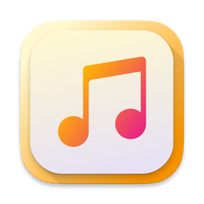
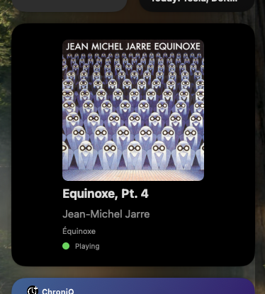
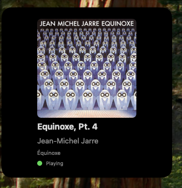

# TuneStatus
A very simple app with widget and menu item to display what's currently playing on Spotify or Apple Music. Made mostly because there's no official Spotify Now Playing widget of some sorts for Mac and I like the simplicity of just swiping from the right to see what is currently playing.

## Features
- Shows your currently playing song from Spotify or Apple Music on your menu bar
- Shows album art both in menu item and widget
- Shows current song time
- Shows status of playback
- Can control playback from app window

Probably (a few) more to come

## Installation

Just download the release from Releases page and put the .app in your /Applications folder.

## Permissions

The app requires permissions to Apple Events (Apple Script here) and since it uses fairly low level calls to use playback control buttons, it will ask for Accessibility permissions.

# Screenshots
#### Notification center:

#### Desktop:

# Licensing

This software is licensed under the MIT License. See the [LICENSE](LICENSE) file for details.
